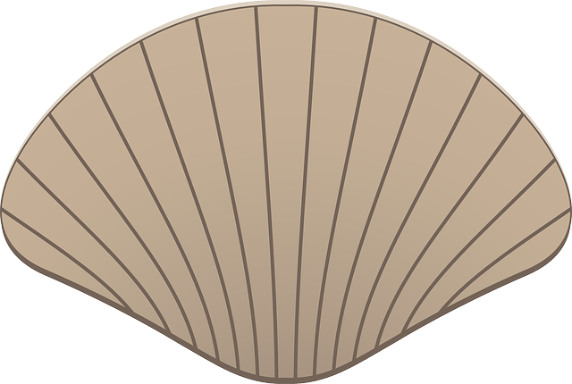
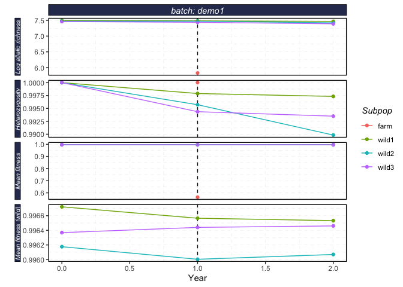
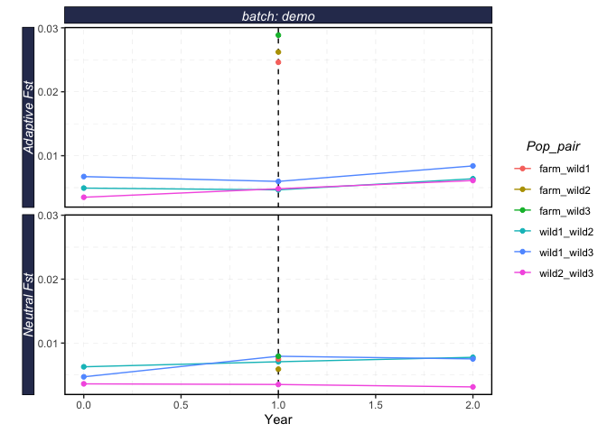
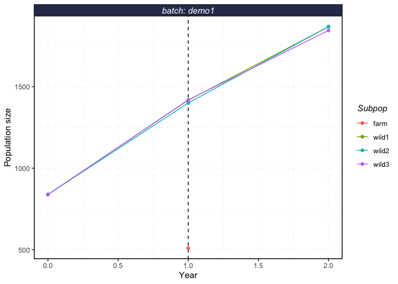

<!-- README.md is generated from README.Rmd. Please edit that file -->

# shellfishrisks 

<!-- badges: start -->
<!-- badges: end -->

Repo for hosting R package for shellfish genetic risk modeling

This package allows for agent based modeling of shellfish genetic risk
modeling. The model itself runs in Python, but users can use this
package to both run and process the results in R.

## Installation

To install shellfishrisks from [GitHub](https://github.com/) run

``` r
# install.packages("devtools")
devtools::install_github("nwfsc-cb/shellfish-genetic-risks")
```

Note that this requires installing the `devtools` package prior to
installing `shellfishrisks`

This package also requires a working Python 3.X installation. The model
is currently built assuming users have an Anaconda installation of
Python. Users unfamiliar with installing Python should install Anaconda
and Python 3.X following the instructions
[here](https://docs.anaconda.com/anaconda/install/). If you are familiar
enough with Python to have strong opinions about the type of Python
installation you would like (i.e. something other than Anaconda) we
shall assume you can do so without our guidance.

We won’t kid you. Users unfamiliar with Python installation may find the
process extremely daunting . We have tried to make this process as
painless as possible. The package is designed assuming use of Anaconda.
We then interface with Python through R using the `reticulate` package.
By default, `reticulate` automatically creates and uses a Conda
(Anaconda) environment called `r-reticulate`. The packages attempts to
install any missing and required Python packages the first time the
package is run, so if you have not previously installed the required
Python packages you will need a working internet connection.

<!-- ## Windows Users -->
<!-- When installing Anaconda, be sure to  -->
<!-- 1. Select "install for all users" -->
<!-- 2. Select the option that asks if you want do add Anaconda to the system PATH (even though it suggests not to) -->

See the example below for the workflow needed to use this package

### Installing Python Packages

`shellfishrisks::install_pypkgs()` installs any missing and required
Python packages

Note that even if you have previously installed packages in another
Python environment the first time you run this you will likely have to
install packages again into the `r-reticulate` Conda environment

For various reasons, if think you need to install Python libraries, you
need to run

``` r
shellfishrisks::install_pypkgs()
```

BEFORE calling

``` r
library(shellfishrisks)
```

Once you have run `shellfishrisks::install_pypkgs()`, YOU MUST RESTART R
COMPLETELY (e.g. exit RStudio and restart it) prior to calling

``` r
library(shellfishrisks)
```

## Example

This example shows you the sequence of steps needed to run
`shellfishrisks`.

See the vignettes in the “Articles” tab for other examples on running
multiple batches at once, or running based on a control file.

``` r
set.seed(42)

library(shellfishrisks) # now load shellfishrisks after installing required python packages
# If you get an error about a missing Python package, restart R completely, and then follow "Installing Python Packages" instructions

shellfishrisks::load_shellfish()
#> shellfishrisks is using Conda environment r-reticulate

# Set options

reps <- 1

coreid <- 1

# All the _years should ideally be set to 50. However, that takes >24 hours to run. For testing, we recommend setting years to 1 to ensure the installation is working properly. 
pre_farm_years <- 1

farm_years <- 1

post_farm_years <- 1
```

``` r
# Run shellfishrisk model: this takes about 20min with these 
# demonstration settings
shellfishrisk(
  batch = "demo",
  reps = reps,
  coreid = coreid,
  pre_farm_years = pre_farm_years,
  farm_years = farm_years,
  post_farm_years = post_farm_years,
  wild_N_init = 100,
  prob_repro_by_month = list('Jan' = 0, 'Feb' = 0, 'Mar' = 0, # for wild reproduction
                           'Apr' = 1, 'May' = 0, 'Jun' = 0, 
                           'Jul' = 0, 'Aug' = 0, 'Sep' = 0, 
                           'Oct' = 0, 'Nov' = 0, 'Dec' =0)
)
```

``` r
results <- serve_shellfish(batches = c("demo")) # read the results stored in .txt files into a list object

str(results)
#> List of 9
#>  $ AFs             :'data.frame':    500 obs. of  11 variables:
#>   ..$ coreid         : int [1:500] 1 1 1 1 1 1 1 1 1 1 ...
#>   ..$ Srep           : int [1:500] 1 1 1 1 1 1 1 1 1 1 ...
#>   ..$ Rep            : int [1:500] 0 0 0 0 0 0 0 0 0 0 ...
#>   ..$ Year           : int [1:500] 0 0 0 0 0 0 0 0 0 0 ...
#>   ..$ Subpop         : chr [1:500] "wild1" "wild1" "wild1" "wild1" ...
#>   ..$ Locus_index    : int [1:500] 0 0 1 1 2 2 3 3 4 4 ...
#>   ..$ Allele         : int [1:500] 0 1 0 1 0 1 0 1 0 1 ...
#>   ..$ Adaptive       : chr [1:500] "True" "True" "True" "True" ...
#>   ..$ Adv            : chr [1:500] "True" "False" "True" "False" ...
#>   ..$ AlleleFrequency: num [1:500] 0.9472 0.0528 0.9033 0.0967 0.8897 ...
#>   ..$ batch          : chr [1:500] "demo" "demo" "demo" "demo" ...
#>  $ bstock_report   :'data.frame':    8 obs. of  5 variables:
#>   ..$ coreid            : int [1:8] 1 1 1 1 1 1 1 1
#>   ..$ Rep               : int [1:8] 0 0 0 0 0 0 0 0
#>   ..$ Year              : int [1:8] 1 1 1 1 1 1 1 1
#>   ..$ IndID_survivedAgeX: num [1:8] 18840 18814 18838 18801 18842 ...
#>   ..$ batch             : chr [1:8] "demo" "demo" "demo" "demo" ...
#>  $ harvest         :'data.frame':    3 obs. of  6 variables:
#>   ..$ coreid       : int [1:3] 1 1 1
#>   ..$ Srep         : int [1:3] 1 1 1
#>   ..$ Rep          : int [1:3] 0 0 0
#>   ..$ Year         : int [1:3] 0 1 2
#>   ..$ IndsHarvested: int [1:3] 0 0 0
#>   ..$ batch        : chr [1:3] "demo" "demo" "demo"
#>  $ life_hist_report:'data.frame':    123846 obs. of  13 variables:
#>   ..$ coreid       : int [1:123846] 1 1 1 1 1 1 1 1 1 1 ...
#>   ..$ Rep          : int [1:123846] 0 0 0 0 0 0 0 0 0 0 ...
#>   ..$ Year         : int [1:123846] 0 0 0 0 0 0 0 0 0 0 ...
#>   ..$ Month        : chr [1:123846] "Jan" "Jan" "Jan" "Jan" ...
#>   ..$ Subpop       : chr [1:123846] "wild1" "wild1" "wild1" "wild1" ...
#>   ..$ IndID        : num [1:123846] 18766 18767 18768 18769 18770 ...
#>   ..$ Sex          : int [1:123846] 2 2 1 1 1 1 1 2 2 2 ...
#>   ..$ CohortYear   : num [1:123846] 0 0 0 0 0 0 0 0 0 0 ...
#>   ..$ Age          : num [1:123846] 7 4.83 1.5 1.67 1.58 ...
#>   ..$ Mother_id    : num [1:123846] 0 0 0 0 0 0 0 0 0 0 ...
#>   ..$ Father_id    : num [1:123846] 0 0 0 0 0 0 0 0 0 0 ...
#>   ..$ meanParentAge: num [1:123846] 0 0 0 0 0 0 0 0 0 0 ...
#>   ..$ batch        : chr [1:123846] "demo" "demo" "demo" "demo" ...
#>  $ log             :'data.frame':    3 obs. of  10 variables:
#>   ..$ coreid    : int [1:3] 1 1 1
#>   ..$ rep       : int [1:3] 0 0 0
#>   ..$ farm_phase: chr [1:3] "pre-farm" "during-farm" "post-farm"
#>   ..$ year      : int [1:3] 0 1 2
#>   ..$ wild1_size: int [1:3] 705 1206 1604
#>   ..$ wild2_size: int [1:3] 735 1242 1638
#>   ..$ wild3_size: int [1:3] 708 1195 1594
#>   ..$ farm_size : int [1:3] NA 495 NA
#>   ..$ time_stamp: chr [1:3] "2021-08-28_16:42:47" "2021-08-28_16:45:42" "2021-08-28_16:50:03"
#>   ..$ batch     : chr [1:3] "demo" "demo" "demo"
#>  $ pop_pair_rvars  :'data.frame':    36 obs. of  8 variables:
#>   ..$ coreid  : int [1:36] 1 1 1 1 1 1 1 1 1 1 ...
#>   ..$ Srep    : int [1:36] 1 1 1 1 1 1 1 1 1 1 ...
#>   ..$ Rep     : int [1:36] 0 0 0 0 0 0 0 0 0 0 ...
#>   ..$ Year    : int [1:36] 0 0 0 0 0 0 0 0 0 1 ...
#>   ..$ Pop_pair: chr [1:36] "wild1_wild2" "wild1_wild2" "wild1_wild2" "wild2_wild3" ...
#>   ..$ Rvar    : chr [1:36] "Fst" "Fst_aL" "Fst_nL" "Fst" ...
#>   ..$ Value   : num [1:36] 0.00582 0.00494 0.00629 0.00358 0.0035 ...
#>   ..$ batch   : chr [1:36] "demo" "demo" "demo" "demo" ...
#>  $ pop_rvars       :'data.frame':    40 obs. of  8 variables:
#>   ..$ coreid: int [1:40] 1 1 1 1 1 1 1 1 1 1 ...
#>   ..$ Srep  : int [1:40] 1 1 1 1 1 1 1 1 1 1 ...
#>   ..$ Rep   : int [1:40] 0 0 0 0 0 0 0 0 0 0 ...
#>   ..$ Year  : int [1:40] 0 0 0 0 0 0 0 0 0 0 ...
#>   ..$ Subpop: chr [1:40] "wild1" "wild1" "wild1" "wild1" ...
#>   ..$ Rvar  : chr [1:40] "mfit" "popsize" "het" "ar" ...
#>   ..$ Value : num [1:40] 0.997 843 1 1820 0.996 ...
#>   ..$ batch : chr [1:40] "demo" "demo" "demo" "demo" ...
#>  $ temp_rvars      :'data.frame':    3 obs. of  7 variables:
#>   ..$ coreid: int [1:3] 1 1 1
#>   ..$ Srep  : int [1:3] 1 1 1
#>   ..$ Rep   : int [1:3] 0 0 0
#>   ..$ Subpop: chr [1:3] "wild1" "wild2" "wild3"
#>   ..$ Rvar  : chr [1:3] "Fst" "Fst" "Fst"
#>   ..$ Value : num [1:3] 7.56e-04 -9.99e-05 8.35e-04
#>   ..$ batch : chr [1:3] "demo" "demo" "demo"
#>  $ survival        : grouped_df [11 × 4] (S3: grouped_df/tbl_df/tbl/data.frame)
#>   ..$ batch       : chr [1:11] "demo" "demo" "demo" "demo" ...
#>   ..$ age         : num [1:11] 0 1 2 3 4 5 6 7 8 9 ...
#>   ..$ survival    : num [1:11] 0.5319 0.3704 0.0559 0.7586 0.6838 ...
#>   ..$ survivorship: num [1:11] 1 0.53193 0.197 0.011 0.00835 ...
#>   ..- attr(*, "groups")= tibble [1 × 2] (S3: tbl_df/tbl/data.frame)
#>   .. ..$ batch: chr "demo"
#>   .. ..$ .rows: list<int> [1:1] 
#>   .. .. ..$ : int [1:11] 1 2 3 4 5 6 7 8 9 10 ...
#>   .. .. ..@ ptype: int(0) 
#>   .. ..- attr(*, ".drop")= logi TRUE

plot_shellfish(results, type = "rvars")
```



``` r
plot_shellfish(results, type = "fst")
```



``` r
plot_shellfish(results, type = "popsize")
```


