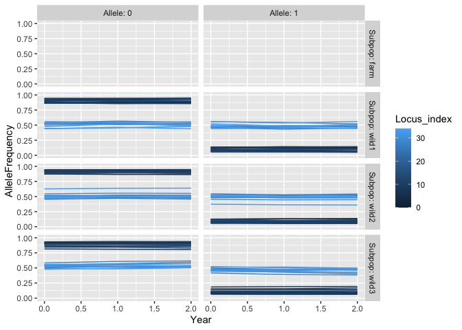

<!-- README.md is generated from README.Rmd. Please edit that file -->

# shellfishrisks

<!-- badges: start -->
<!-- badges: end -->

Repo for hosting R package for shellfish genetic risk modeling

This package allows for agent based modeling of shellfish genetic risk
modeling. The model itself runs in Python, but users can use this
package to both run and process the results in R.

## Installation

To install shellfishrisks from [GitHub](https://github.com/) run

``` r
# install.packages("devtools")
devtools::install_github("nwfsc-cb/shellfish-genetic-risks")
```

Note that this requires installing the `devtools` package prior to
installing `shellfishrisks`

This package also requires a working Python 3.X installation. The model
is currently built assuming users have an Anaconda installation of
Python. Users unfamiliar with installing Python should install Anaconda
and Python 3.X following the instructions
[here](https://docs.anaconda.com/anaconda/install/). If you are familiar
enough with Python to have strong opinions about the type of Python
installation you would like (i.e. something other than Anaconda) we
shall assume you can do so without our guidance.

We won’t kid you. Users unfamiliar with Python installation may find the
process extremely daunting . We have tried to make this process as
painless as possible. The package is designed assuming use of Anaconda.
We then interface with Python through R using the `reticulate` package.
By default, `reticulate` automatically creates and uses a Conda
(Anaconda) environment called `r-reticulate`. The packages attempts to
install any missing and required Python packages the first time the
package is run, so if you have not previously installed the required
Python packages you will need a working internet connection.

See the example below for the workflow needed to use this package

## Example

This example shows you the sequence of steps needed to install required
Python packages and run `shellfishrisks`.

``` r
set.seed(42)
# For various reasons, if think you need to install Python libraries, you need to run this BEFORE calling library(shellfishrisks)

shellfishrisks::install_pypkgs() # installs any missing and required Python packages
#> shellfishrisks is using Conda environment 'r-reticulate'
# Note that even if you have previously installed packages in another Python environment the
# first time you run this you will likely have to install packages again into the `r-reticulate` 
# Conda environment

library(shellfishrisks) # now load shellfishrisks after installing required python packages
# If you get an error about a missing Python package, restart R, and then run shellfishrisks::install_pypgks() BEFORE running library(shellfishrisks)

library(ggplot2)

library(dplyr)
#> 
#> Attaching package: 'dplyr'
#> The following objects are masked from 'package:stats':
#> 
#>     filter, lag
#> The following objects are masked from 'package:base':
#> 
#>     intersect, setdiff, setequal, union

# Set options
batch_name <- "dev"

reps <- 1

coreid <- 1

# All the _years should ideally be set to 50. However, that takes >24 hours to run. For testing, we recommend setting years to 1 to ensure the installation is working properly. 
pre_farm_years <- 1 

farm_years <- 1

post_farm_years <- 1

# Run shellfishrisk model: this takes about 20min with these 
# demonstration settings
shellfishrisk(
  batch = batch_name,
  reps = reps,
  coreid = coreid,
  pre_farm_years = pre_farm_years,
  farm_years = farm_years,
  post_farm_years = post_farm_years,
  wild_N_init = 100
)

clean_shellfish(batch = batch_name) # move the results to a folder of the form results/{batch}
#> results moved to results/dev

results <- serve_shellfish(batch = batch_name, results_dir = file.path("results",batch_name)) # read the results stored in .txt files into a list object

str(results)
#> List of 8
#>  $ AFs             :'data.frame':    500 obs. of  10 variables:
#>   ..$ coreid         : int [1:500] 1 1 1 1 1 1 1 1 1 1 ...
#>   ..$ Srep           : int [1:500] 1 1 1 1 1 1 1 1 1 1 ...
#>   ..$ Rep            : int [1:500] 0 0 0 0 0 0 0 0 0 0 ...
#>   ..$ Year           : int [1:500] 0 0 0 0 0 0 0 0 0 0 ...
#>   ..$ Subpop         : chr [1:500] "wild1" "wild1" "wild1" "wild1" ...
#>   ..$ Locus_index    : int [1:500] 0 0 1 1 2 2 3 3 4 4 ...
#>   ..$ Allele         : int [1:500] 0 1 0 1 0 1 0 1 0 1 ...
#>   ..$ Adaptive       : chr [1:500] "True" "True" "True" "True" ...
#>   ..$ Adv            : chr [1:500] "True" "False" "True" "False" ...
#>   ..$ AlleleFrequency: num [1:500] 0.883 0.117 0.863 0.137 0.884 ...
#>  $ bstock_report   :'data.frame':    10 obs. of  4 variables:
#>   ..$ coreid            : int [1:10] 1 1 1 1 1 1 1 1 1 1
#>   ..$ Rep               : int [1:10] 0 0 0 0 0 0 0 0 0 0
#>   ..$ Year              : int [1:10] 1 1 1 1 1 1 1 1 1 1
#>   ..$ IndID_survivedAgeX: num [1:10] 59 43 20 14 87 75 56 35 2 68
#>  $ harvest         :'data.frame':    3 obs. of  5 variables:
#>   ..$ coreid       : int [1:3] 1 1 1
#>   ..$ Srep         : int [1:3] 1 1 1
#>   ..$ Rep          : int [1:3] 0 0 0
#>   ..$ Year         : int [1:3] 0 1 2
#>   ..$ IndsHarvested: int [1:3] 0 0 0
#>  $ life_hist_report:'data.frame':    123420 obs. of  12 variables:
#>   ..$ coreid       : int [1:123420] 1 1 1 1 1 1 1 1 1 1 ...
#>   ..$ Rep          : int [1:123420] 0 0 0 0 0 0 0 0 0 0 ...
#>   ..$ Year         : int [1:123420] 0 0 0 0 0 0 0 0 0 0 ...
#>   ..$ Month        : chr [1:123420] "Jan" "Jan" "Jan" "Jan" ...
#>   ..$ Subpop       : chr [1:123420] "wild1" "wild1" "wild1" "wild1" ...
#>   ..$ IndID        : num [1:123420] 1 2 3 4 5 6 7 8 9 10 ...
#>   ..$ Sex          : int [1:123420] 2 1 1 1 1 2 1 2 1 1 ...
#>   ..$ CohortYear   : num [1:123420] 0 0 0 0 0 0 0 0 0 0 ...
#>   ..$ Age          : num [1:123420] 2.08 4.67 4.67 3.92 6.92 ...
#>   ..$ Mother_id    : num [1:123420] 0 0 0 0 0 0 0 0 0 0 ...
#>   ..$ Father_id    : num [1:123420] 0 0 0 0 0 0 0 0 0 0 ...
#>   ..$ meanParentAge: num [1:123420] 0 0 0 0 0 0 0 0 0 0 ...
#>  $ log             :'data.frame':    3 obs. of  9 variables:
#>   ..$ coreid    : int [1:3] 1 1 1
#>   ..$ rep       : int [1:3] 0 0 0
#>   ..$ farm_phase: chr [1:3] "pre-farm" "during-farm" "post-farm"
#>   ..$ year      : int [1:3] 0 1 2
#>   ..$ wild1_size: int [1:3] 717 1205 1606
#>   ..$ wild2_size: int [1:3] 732 1233 1592
#>   ..$ wild3_size: int [1:3] 711 1205 1547
#>   ..$ farm_size : int [1:3] NA 491 NA
#>   ..$ time_stamp: chr [1:3] "2021-08-11_11:32:48" "2021-08-11_11:35:33" "2021-08-11_11:39:22"
#>  $ pop_pair_rvars  :'data.frame':    36 obs. of  7 variables:
#>   ..$ coreid  : int [1:36] 1 1 1 1 1 1 1 1 1 1 ...
#>   ..$ Srep    : int [1:36] 1 1 1 1 1 1 1 1 1 1 ...
#>   ..$ Rep     : int [1:36] 0 0 0 0 0 0 0 0 0 0 ...
#>   ..$ Year    : int [1:36] 0 0 0 0 0 0 0 0 0 1 ...
#>   ..$ Pop_pair: chr [1:36] "wild1_wild2" "wild1_wild2" "wild1_wild2" "wild2_wild3" ...
#>   ..$ Rvar    : chr [1:36] "Fst" "Fst_aL" "Fst_nL" "Fst" ...
#>   ..$ Value   : num [1:36] 0.01217 0.00779 0.01451 0.008 0.00481 ...
#>  $ pop_rvars       :'data.frame':    40 obs. of  7 variables:
#>   ..$ coreid: int [1:40] 1 1 1 1 1 1 1 1 1 1 ...
#>   ..$ Srep  : int [1:40] 1 1 1 1 1 1 1 1 1 1 ...
#>   ..$ Rep   : int [1:40] 0 0 0 0 0 0 0 0 0 0 ...
#>   ..$ Year  : int [1:40] 0 0 0 0 0 0 0 0 0 0 ...
#>   ..$ Subpop: chr [1:40] "wild1" "wild1" "wild1" "wild1" ...
#>   ..$ Rvar  : chr [1:40] "mfit" "popsize" "het" "ar" ...
#>   ..$ Value : num [1:40] 0.997 845 1 1860 0.997 ...
#>  $ temp_rvars      :'data.frame':    3 obs. of  6 variables:
#>   ..$ coreid: int [1:3] 1 1 1
#>   ..$ Srep  : int [1:3] 1 1 1
#>   ..$ Rep   : int [1:3] 0 0 0
#>   ..$ Subpop: chr [1:3] "wild1" "wild2" "wild3"
#>   ..$ Rvar  : chr [1:3] "Fst" "Fst" "Fst"
#>   ..$ Value : num [1:3] 3.34e-04 3.98e-04 7.57e-05

results$AFs %>% 
  ggplot(aes(Year, AlleleFrequency, color = Locus_index, group = Locus_index)) + 
  geom_line() + 
  facet_grid(Subpop ~ Allele, labeller = label_both)
#> geom_path: Each group consists of only one observation. Do you need to adjust
#> the group aesthetic?
#> geom_path: Each group consists of only one observation. Do you need to adjust
#> the group aesthetic?
```



``` r


results$pop_pair_rvars %>% 
  ggplot(aes(Year, Value, color = Pop_pair)) + 
  geom_line() + 
  facet_wrap(~ Rvar, labeller = label_both, scales = "free_y")
```


